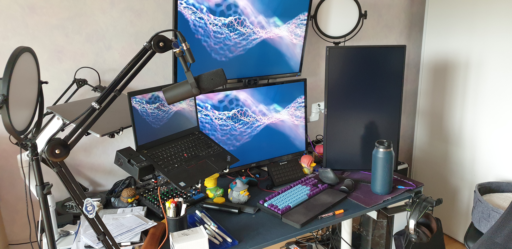

After 3 years of full remote work, i think my home office is starting to look acceptable. So let's share it. This is of course a work in progress. I usually prioritise getting something more expensive if i expect it to stand the test of time. If i will probably still use it without pain in a decade, i am ready to pay more for it. Keep that in mind.
<!--more-->

## Furniture

This is probably the place i invested into the least. I need to up my game at some point, but it is the part that needs to adapt the most to your needs. It is probably the last rubric i will invest more into. I prefer to have a good idea of my needs and for my life to settle a bit before that.

- Ikea JÄRVFJÄLLET: I think this is the minimum acceptable home office chair. At this price point, i have not found better. The seat is good, the back support is not bad. Is there better out there ? Yes. But for less than 200EUR, you get a really good chair for that price. And anything under that tend to be paid badly by your back.
- Ikea Bekant: The basic Ikea desk. Not a lot to say. It works. The cable management system is honestly not bad if you are not going too deep. It is showing its limits in term of cable management for me, but as you will see in the following rubric it is more due to the number of stuff i have on this. Impressively resistant for what it looks like and the feet are a good chunk of metal.
- ErgoFoam foot rest: newcomer as of last week ! I am still searching for a good foot rest, as the FR300 from Humanscale is impossible to get delivered in France. Or anywhere in Europe as far as i can tell. Hopefully this one fit the bill.
- Glass-board, 90cmx120cm blue: I love white-boarding stuff, it is how i think. But cleaning them is a pain, and they tend to not clean that well if you let things dry on them. So i decided to try a glass-board. 100% would recommend, it is a massive upgrade. This one come from "glassboard-shop.de", they have online shops in a ton of EU country. Delivered fast, you can ask for nearly any size. It is honestly a great addition to my setup. Big problem for me is the support. It is solid metal, but it is not great. The casters break, it is hard to move, it is not stable. I have yet to find a good one though, seems the market is empty. It may end up being the first custom piece of furniture i own. Other small downside is that you need rare earth magnet if you want to pin things on it, as the glass is far thicker than the usual wood for a white-board. Not really that big of a problem, but be aware of the safety hazards of them. See also later for the pens i advise to go with it.

## Audio

There is a lot of money spent on Audio in my setup, and honestly it is worth it. If you work remotely, outside of money spent on better ergonomics, audio is your next best investment. A good audio setup will make you sound smarter and more confident on remote call. And it will simplify your life. A good audio setup does not need you to unmute all the time as an example. I cannot emphasize enough how important a good audio setup is if you want to be an expensive professional.

- Shure SM7B: THE mic. I used to use a Blue Yeti. When time came to upgrade, i went all in. You cannot go wrong with this one, and it will be one of the best for at least a decade. Built like a tank too and come with its own pop filter. Yes it is expensive, yes it needs tooling around it. But if you are in any position in software that can afford it and you expect to work remotely for a long time, it is honestly worth it.
- Rode PSA-1: You need a boom arm that can stand the weight of the SM7B and will work well. This one is a tank and work perfectly out of the box. That is rare. After 2 years, it has barely moved. 100% recommend.
- Cloudlifter CL-1: The SM7B output a relatively low signal. This pre-amp does the job to boost it. Depending on what you use to drive the SM7B, you may not need it. It use phantom power, so make sure you get something that can power it.
- Yamaha MG10XU: I needed a mixing table that could take the audio from the mic and drive it, connect hot to Linux, Mac and Windows, and could easily take more input if i wanted to stream or share stuff. This one just work, but is probably a bit overkill. That said, being able to hot plug an audio mixing table into Linux and it Just Works TM is rare enough that i think it was worth the price. If you have less needs, the Go XLR or one of the Scarlet are probably good enough.
- AKG K712 and AKG Q701: My best headphones i have ever owned. Working from home means you can have an open design. I prefer circum-aural headphones, i have found that other design hurt my hears. An open design means less problems of heat over time. And these have an amazing sound. And they have a detachable cable, which is super useful if you need to put a longer length. AKG design for their headphones is also great for wearing them for hours and hours, as it make them feel super light on the head. 100% recommend.
- 2x Gravity headphones holder: discovered them while browsing Thomann for other things, work great for cheap. Feel solid. Thomann is a place to discover all kind of amazing things.

## Video

This is less important than audio, and more expensive. Good lighting helps a lot more than a good webcam in general, and cost far less. So i advise to prioritise that. A good lighting make the cam have an easier time being crisp and nice, which is why it has been prioritized over investing in an over the top Sony setup... Which will probably still happen in the near future.

- Logitech c920: Nothing special to say, the standard Logitech good webcam. I will probably invest in a better solution in the near future, but for now it works for me.
- 2x GVM Desk Mount LED Video Light, 10" Round Key Light with Built-in Diffuser and LCD Display CRI 97+: Discovered these thanks to Adam Savage's Tested, they were a pain to get a hold off in Europe. Had to import them from the US. But totally worth it. They do not make me feel close to a sun, both in term of glare and heat. They are totally controllable in brightness and warmth. There is no need for a reflector thanks to the diffuser. And they still light perfectly. Cannot recommend enough. There are chinesium cheaper copy around, I have not tested these.
- Elgato Greenscren: Nothing special to say, you can find copies going around if you want cheaper, this is still a really good green screen, easy to set up. It has a good stable colour and it does not wrinkle at all, which help in the final result.
- Magewell Pro Capture Dual HDMI 4K Plus LT: OK so let's be honest. This is overkill. I probably do not need the 4k. I could probably deal with a non pass-through card. And i rarely need the second input... But it just works. It is easy to setup and tweak the setting. It would have been expensive anyway. And it is a long term investment. It does the exact job it says on the box. It was super easy to setup. And it allows me to capture the Linux or Mac machine screen to send to OBS or directly to Zoom on the Windows machine. Perfect for pairing and streaming when i code. Long term it will be useful to capture the probable replacement for the webcam thanks to the second hdmi input...

## Computers

This is a fun mix. I use Linux (Fedora) on the Thinkpad for all of my daily work need. The Windows PC is not specified in details, as it is a Ship of Theseus, with ever changing components. It is here for two reasons. First of all, all the AV stuff, like video conference and OBS. As they have all far better support and interface on windows. And they better use the CPU power without overheating. And as a gaming PC as a second use case.

The Macbook is not here to stay, i do not want it. After years on Mac, i told myself i would stop using an OS stuck in the mid 00s. Sadly, my employer force it on me to access their pre-installed VPN. And i have not not yet tried to make it work on the Linux machine. Maybe one day

- Self-assembled and ever evolving Windows PC
- Thinkpad dock: It works relatively ok. I do not remember which one it is and to be honest i would not advise it. It has enough connections problems to make me regularly unhappy about it. And i think Lenovo discontinued it anyway.
- Thinkpad T480s Fedora: Thinkpad T serie has a good history with Linux. That is why i picked it. I needed something portable to be able to work in strange place, in particular in case of on-call. It just works, it has a good battery life, Fedora just worked on it. Nothing bad to say, it does the work without being in the middle.
- Macbook pro: Ugh I wan this thing to disappear.

## Monitors

This is a still evolving section. I put everything, monitors and laptop, on Ergotron arms. This enable to move things around easily and free space on the desk.

I use a lot of screen space, cause i have never been able to deal well with constant alt-tabbing between virtual desktop and windows. I think in term of spatial positions and moving eyes around.

Small point while i am at it. Please always switch to a sRGB setting on your monitors, if you do not plan to calibrate your screens with a probe. And reduce the brightness as much as possible while still being useful. You will thank me for the additional comfort. It is also always worth spending a few minutes playing with whatever "ghosting" is called for yours (it is sometimes called "overclock"). And while you are at it, also have a look at the "sharpness" setting. You can make a screen look far better in a few minutes. And you will look at it for hours. Do it.

Oh and yes, i will probably get a probe at some point. It is not that expensive and is a good investment for the future.

- 2x AOC Q3277PQU: These are amazing. Fast response, great colors, 32", 2560x1440, great angles, good black. They do not heat that much. Their main problem is their weight, i am nearly at the limit of what the Ergotron LX can do. I would still recommend them in a heartbeat. My workhorses
- Asus VG27A: Lightweight, 27" (so easier to set vertical and closer to me), good response time, 2560x1440. OK that is it for the good points. The bad one... This thing is far too bright, even at the lowest settings i could select. And it generate a ton of heat. The two problems are probably linked. So it is probably going to disappear from my setup soon. As soon as i find a replacement.
- 5x Ergotron LX arm, with 3 support: This is a bit of a complex setup. But in general, if you want to put your screens and laptop on arms, just go straight to Ergotron. Yes, they are super expensive. But they are built like tanks, just work, and are really easy to move around. Other arms may cost only half of it, but they will be forever painful everyday. And they will stay, as it is not something you change regularly. Invest in your Quality of Life and go straight to Ergotron. Trust me.
- 2x Ergotron laptop support add on: It just works and it is the only VESA compatible laptop tablet support i could find without an edge. The Velcro to stick a dock on it worked great too and it is supporting it really well. The Amazon Basics is a carbon copy, that i suspect come from the same manufacturer and the exact same production line. So feel free to pick it if you prefer it. 

## Inputs

This is a bit of a kitchen sink but hey.

- Logitech MX Vertical: I moved to a vertical mouse thanks to a designer friend a few years ago. And i would never come back. Sadly the choice is rather limited. Thankfully we are not stuck with no-name cheap and painful mouse anymore. Logitech released this one a couple year ago and i am not going back. Perfectly recognized as bluetooth, cabled, or with the Logitech universal thingy dongle.
- WASD Keyboard V3 (customized): I like Cherry MX Clear and they are a pain to get on the classic choices. Luckily WASD offer them for their keyboards. So here i am. Nothing bad to say, if you like the Clears, this is for you.
- Streamdeck XL: This was bought as a way to pad an invoice of audio stuff, on a whim. But to be honest, it is super useful. I use it as a soundboard, as a mute button, as a way to switch scenes on OBS, etc. It is far too useful... but it is expensive and the updates have been wrecking some in the past. Definitely not necessary.
- Logitech Spotlight: Finding a good remote for presentations is hard. I have yet to find the one that will win my heart. But this one work and does a lot of stuff that i sometime use. So hey. Not too bad.
- XP Pen Deco Pro medium: I am testing using a graphic tablet for all the sessions in which i need to draw. I am a big white-board fan, but doing it remotely can be painful. So I am testing this. It has a good Linux driver, a good Windows and mMac one. So it is a good pick if you need a graphic input. I just don't know yet how much i will use it and how much it will stay a gimmick. I still need to find a way to integrate it nicely on my setup though. We will see.

## USB Kitchen Sink

The USB market is, quite honestly, a shitshow. There is a ton of crap, a few good stuff, the brands are inconsistent about their qualities... All of them. There is no standard or certification worth shit. It looks like the PSU market in the 00s. I really want some brand to step in and clean the shit. Please. Prosumers like me need it. I am ready to pay more if i know i do not have to pray for it to kill nothing. Or to lose its magical smoke randomly. In the meantime, here is mine.

- Startech USB 4-way switch: It works. I don't know if i would advise it. Allows me to switch my Keyboard and Mouse between machines. I would use Synergy, but it is not ready yet for Wayland. Oh and the Yubikey is on it too.
- TP LINK 7 port USB hub: I used to have a Startech one. But it killed 2 keyboard (expensive one) with electrostatic discharge. So now i use that TP-Link which seems better. We will see. As i was saying the USB market is just a shitshow.
- Yubikey: I have an old yubikey i bought years ago. It is my 2FA go to device and i cannot live without. I get fed up of getting the phone out, unlocking it, unlocking the TOTP app and then pressing notifications or copying a 6 digits code. This is just a touch button and it just work. Everywhere. And no need to install any strange app on my overburdened phone. 100% would recommend.

## Diverse office supply

- Uchida Bistro Chalk Marker (medium and small): I use these to go on the glass-board and i cannot advise them enough. They just work and they allow me to get colors that pop and are still easy enough to clean.

## Conclusion

I do not know if i have a real conclusion. This is the state of my Home Office setup mid 2021. We will see if it keeps evolving. If you have ideas and things to advise, feel free to share on twitter or by email!
