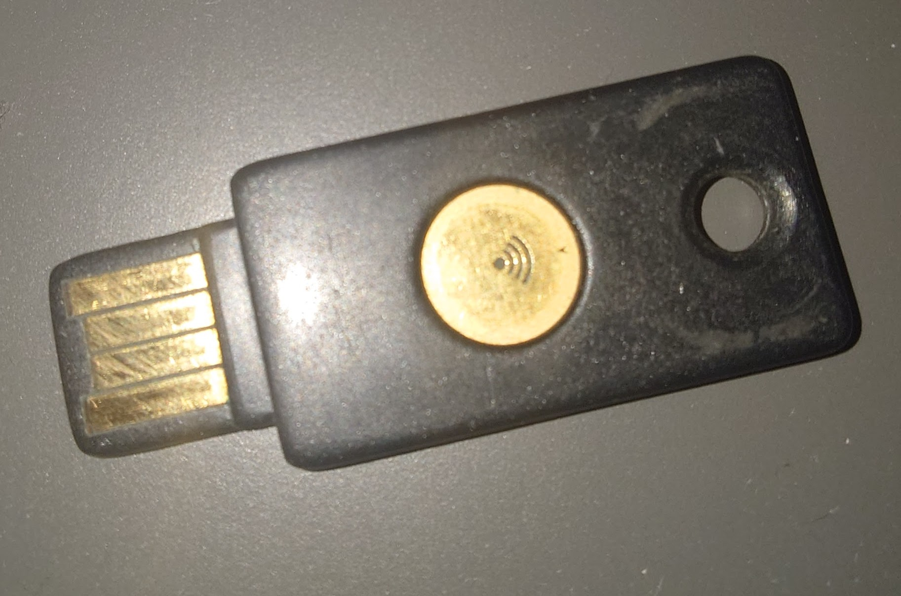

Recently, PyPI announced that they would force everyone that maintains a
project or an organization on the platform [will have to enable
2FA](https://blog.pypi.org/posts/2023-05-25-securing-pypi-with-2fa/). This is
one more step in the direction of strongly protecting the package providers and
their users. I am not opposed to it. But it made me think of the discussions we
have around FOSS about reciprocity and unfair burden[^1]. And about double
standards. And how it is hard to make corporations understand the upside of
Open Source, and how diffuse it is. Let's talk about security tokens, 2FA, and
how corporations do not understand their place in the FOSS ecosystem.
<!--more-->

## About Security Tokens

This is my yubikey. It is... not new. I bought it in 2016, 7 years ago, nearly
to this day. I bought it to secure... I do not remember, but I think I wanted to
secure my password manager at the time. And probably my email. I bought it
because I was losing my mind using OTP codes. It meant I would not have to think
about my passwords leaking, I could secure my password manager on my phone (at
the time, only LastPass supported this on Android). And more importantly, I
would not have to find my phone, unlock it, find a code, and copy it _every time
I logged into something_.

This may seem nothing to you, but to someone like me with ADHD, doing that a
couple of times a day would make me lose my mind. To the point that I would avoid
2FA. This key changed my life. I would just have to plug it into the device I
used, and whenever needed, just press the button. No need to think. No action to
do. It just worked.

In the next week, I will replace it with a newer version. One that supports FIDO2,
USB-C, and so much more. But I do not talk about this to show off my new
yubikeys. They are not here there anyway. No, the reason I talk of Yubikey and
Security Token is all due to PyPI... And the corporations I have worked for.
See, everywhere in their communication about the mandatory 2FA, PyPI pushes
strongly for you to use a security token as your second factor[^2]. I strongly
agree with them on that, this is by far the most secure and practical choice.

## The Growing Cost of Participating in FOSS

This is not limited to PyPI. Github is quickly mandating it, and I would not be
surprised if we see this demand propagate. I expect NPM to follow soon. On
the "supply chain" side of the discussion, this makes a lot of sense. A
credential-stuffing attack on the maintainer of a well-used package would allow
uploading a nefarious version, and all other kinds of attacks. And yes, there are
other solutions and defenses, but honestly, we all agree we should 2FA all the
things right? So that is a pretty uncontroversial decision. Right?

Well actually. I am not going to yell too much about this being bad, or undue
burden. After all, I bought one when I was a student with no income. And we have
seen some campaigns to equip maintainers, so there has been some real investment
by concerned parties in reducing the onboarding cost. It is still not available
to everyone, it has a real cost and it is not what people expected when they put
their code online.

It also means that if you live in a less wealthy situation than the tech
industry in the Western side of the world, you are probably now in a relatively
steep situation if you want to be a "good citizen" of FOSS. But it is ok. You
can use your phone with an authenticator App.[^3]

## Double Standard

On the other hand, a lot of the organizations that are part of this push for
"supply chain" security are also in the tech industry, regularly offering tools
supposed to be used by software engineers. And for a lot of them, the support
for security tokens is ... spotty. At best.[^4] As mentioned above, I have used
a yubikey everywhere I can for 7 years now. And I can tell you, there are some
providers I have a personal beef with, due to their poor support for them.

It is especially jarring to see this coming from tech corporations. They are
right that maintainers are a juicy target for all kinds of attackers. But
that is also true of their software engineers. These are _known_ to be
"risky" targets and as such we also have seen a push for 2FA toward employees in
these corporate entities. My employer has been tightening the hatches on
this aspect recently. Developers have large access, push code that could be
"infected", and have a lot of access both on their machine and production machines.
You can understand that if PyPI mandates it, the internal security team of
corporations would do the same.

And yet, bar some exceptions, I know of nearly no corporation that distributes
security tokens to their employees. Even less at the SMB level. And yet, these
are not that expensive. At least compared to some other programs and licenses
that corporations happily spend, with a cost per employee too. They have high
benefits, being more secure but also easier to use. They seem like a no-brainer.
Even less have I seen them distributed as "swag"[^5] for personal use, despite
seeing far stranger[^6] gifts by employers to employees.

## Security at Home is Security Everywhere

And we have a precedent here. It is not rare today that the password manager you
use for work is also offered as a "benefit" to use for your family at home. This
is a win-win-win situation for everyone. The password manager provider gets new
users, with stickiness, and in general market penetration. The employer ensures
that your home network and account are secure, as they are another vector to
penetrate their internal network.[^7] And the employee gets a top-of-the-line
free password manager. Why not do that for security tokens? After all, they walk
hand in hand with a password manager and an SSO service. Give a key as swag. For
Christmas. And provide a way to buy them for the family, at a discount.

But there is also another aspect to this. If corporations are so scared of
supply chain attacks through credential stuffing, they should create an environment
that helps fight it. Make it easy to use a security token on your own services.
So that everyone has incentives to do it. But also, maintainers are nearly all
employed by a corporate entity, in a lot of cases in IT. Especially the often
talked about "burner out, working on it on free time" maintainer, who usually
have a day job in one of these corporations. By distributing security tokens that
they can use at home, you would automatically get
that many maintainers equipped.

Of course, it may not be the maintainers you depend on. But if this was a
practice as widespread as providing a "family" version of password managers as
a benefit, then we would cover a large part of the maintainers. Your employee may
maintain a dependency used by a corporation on the other side of the planet, but
there is a high chance you depend on a package maintained by someone on their
side too. I feel that this understanding of the porosity between the commercial
and FOSS engineers is not well understood.

At least, what we can see is a strong double standard at play here. The reason
FOSS maintainers are getting forced into 2FA is not because they are more at
risk. Or because they cannot lobby. It is because they _can accept this change_,
while corporations cannot. It is not that corporations are forcing this on the
FOSS world. It is that corporation are far worse security practices than most of
FOSS, and are far less aware of the impact on the wider world of their security
failures.

## We Are Not That Different

I regularly talk to managers and engineers in these companies that imagine that
OSS developers are not at all _like them_ but live a far different life. That
they are not employed in their own teams. That they are "out there" but
definitely not around here. I hear discussions that FOSS security is a "consumer
of OSS" problem, not a maintainer problem. The security token and
2FA push shows that there is no difference. The consumers of OSS are the
same people as the ones that build it. One side is organized, on the corporate
side of their life. The other may not be. But if we want a safer FOSS, maybe we
should start by making the tech industry at large practice what they ask us.

These two worlds are highly porous between them. If you want things to get better
on the supply side, simply provide your employees with these practices and
tools. And see how it translates so well. Engineering for FOSS is no different
than for commercial software. We have different incentives, resources, and goals.
But deep down? The practices are the same. And the upside of doing better is as
hard to realize and invest in, on both sides. I mean after all. All these 2FA
support and toolings around it are Open Source.

---------

[^1]: I do not think PyPI do this here, they seem to have taken the decision
    they believe is right. But it is something I feel in the
    discussions around the Supply Chain.

[^2]: Realistically, yubikeys are the main answer here. Yes, there are others but please.

[^3]: For now. But seeing how fast this moves, i doubt we will end the decade
    with these still being accepted.

[^4]: And I am being polite here. Extremely polite. I am trying to swear less in
    this blog, as some of my readers are Americans these days.

[^5]: Think t-shirt, USB keys, backpack, cap, and other "branded" stuff.

[^6]: And expensive. And useless.

[^7]: As part of the LastPass attack. the machine of a DevOps engineer was
    breached through their personal Plex server.
